## 传统CMS系统到Serverless架构重构实战


改造前我们需要将相应的资源准备一下。开通阿里云的相关产品，申请自定义域名，下载开发者工具Serverless Devs，相关需要开通的产品列表如下(注：以下产品开通均不收费)
+ 阿里云函数计算 （必需）
+ 阿里云OSS 
+ 阿里云RDS for mysql serverless版
+ 阿里云Api Gateway 
+ 阿里云DNS 服务 （必需）
+ 阿里云NAS服务 （必需）
+ 阿里云ARMS （选开）

### 重构基本策略
本身这个项目包含了 后台API 服务， 前端Portal和后台管理三个部分，我们先开始从 后台API服务改造开始，因为API服务是后面二者的基础依赖，之后其余两个项目的顺序可以任意。
### 后台API服务
#### 测试项目
改造之前先验证一下项目是否可用，按照如下步骤操作：
- 安装好本地数据库，并进行数据初始化
- 进入server 目录安装好依赖，执行启动指令
- 打开浏览器访问端口查看

测试效果如下，接口访问没有问题，数据库内容也查询的到

#### 代码改造
对代码的改造主要关注三个点
1. 静态资源的写，比如日志写入，静态文件写入等。 函数计算的运行时环境是只读的，所以如果想继续保持正常的静态文件写入，要么使用nas做目录映射，要么把日志服务和静态文件写入服务跟函数逻辑独立出来（比如用阿里云SLS以及OSS），后者成本较大，我们本次采用前者
[日志配置]
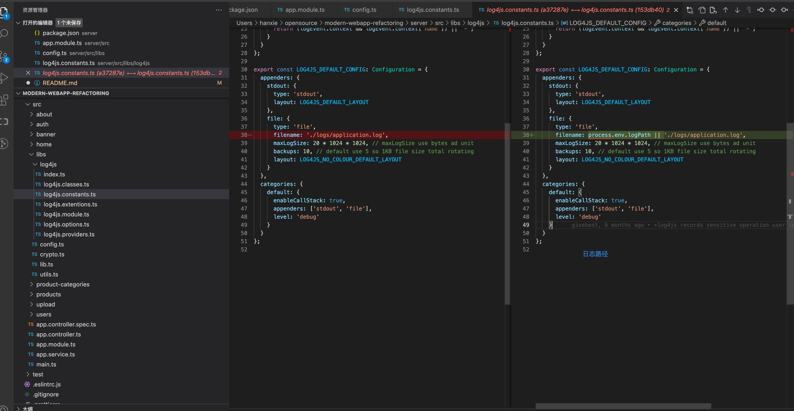
[文件上传]
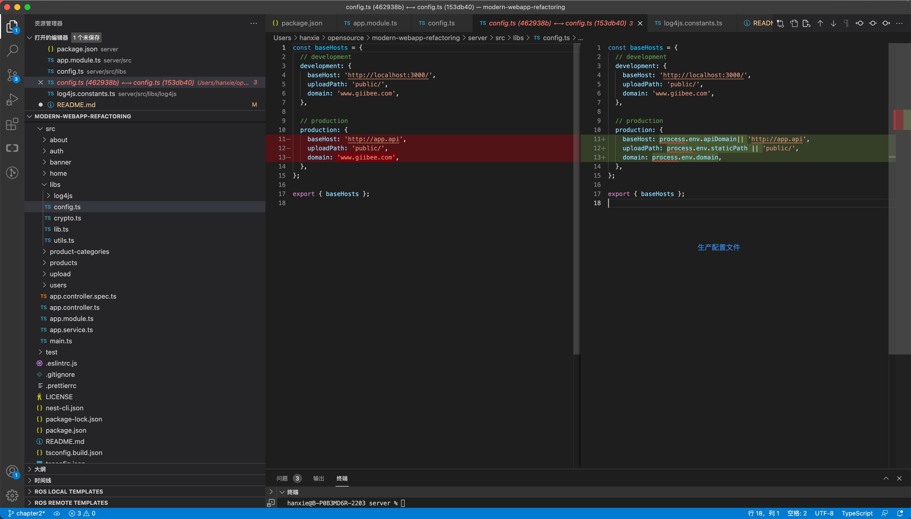
[静态资源访问]
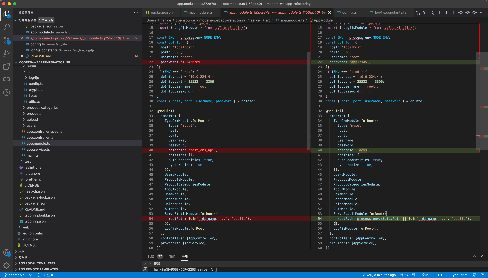

2. 配置项相关，比如数据库配置，其他秘钥配置等。 我们需要把配置项用环境变量填充，将环境变量存储到本地.env文件，并最终映射到函数计算的环境变量配置上供函数运行时读取，注意这里.env不建议上传代码仓库，避免包含的秘钥配置泄露
[数据库配置]
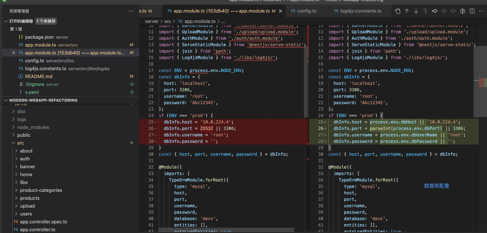

3. 启动入口编写
这里涉及函数计算运行时的一些说明，一般我们部署一个简单的函数，只需要选择函数开发语言对应的运行时即可，比如nodejs的runtime，程序中只要暴露出 handler 处理函数即可，但对于更复杂的独立项目型函数不太适合做 handler改造的，就更适合采用custom runtime，不改动源码，只是增加一个启动入口文件bootstrap,通常这个bootstrap里面是写启动这个后台服务的脚本，比如这里增加一个bootstrap文件，内容如下：
```
#!/usr/bin/env bash
export PORT=3000
node dist/main.js
```
可以看到先是指定了指令运行环境，然后指定开放端口3000,接下来执行启动服务的指令。 
完成以上改造之后就可以为当前的工程配置部署文件了
#### 配置及部署
部署API 服务所需要的 s.yaml 配置如下

```javascript
edition: 1.0.0
name: modern-app-new
access: hanxie
vars:
  region: cn-hangzhou
  fc: 
    serviceName: 'modern-app-new'
    functionName: 'modern-app-new'
    triggers: 'modern-web-api'
    staticPath: '/mnt/auto/modern-app-new/public'
    logPath: '/mnt/auto/modern-app-new/logs/application.log'
services:
  api-server:
    component: fc
    actions:
      post-deploy: # 在deploy之后运行
      - plugin: keep-warm-fc
        args:
          url: http://modern-app-new.modern-app-new.1611387345152601.cn-hangzhou.fc.devsapp.net
    # actions:
    #   post-deploy:
    #     - component: fc nas upload -r ./server/logs /mnt/auto/modern-app-new
    #     - component: fc nas upload -r ./server/public /mnt/auto/modern-app-new
    props:
      region: ${vars.region}
      service:
        name: ${vars.fc.serviceName}
        description: Aliyun RAM Role
        internetAccess: true
        nasConfig: auto
      function:
        name: ${vars.fc.functionName}
        description: Native recording handler
        timeout: 3000
        memorySize: 1024
        runtime: custom
        environmentVariables:
          NODE_ENV: production
          dbHost: 
          dbPort: 3306
          dbPassword: 
          dbUserName: 
          staticPath: ${vars.fc.staticPath}
          logPath: ${vars.fc.logPath}
        codeUri: ./server
        caPort: 3000
      triggers:
        - name: ${vars.fc.triggers}
          type: http
          config:
            authType: anonymous
            methods:
              - GET
              - POST
              - PUT
              - DELETE
              - HEAD
              - OPTIONS
      customDomains:
        - domainName: auto
          protocol: HTTP
          routeConfigs:
            - path: '/*'
              serviceName: ${vars.fc.serviceName}
              functionName:  ${vars.fc.functionName}
```
需要注意的是actions部分就是增加了对nas服务的映射，避免函数运行时无法写的问题，这部分实际上只应当执行一次（映射好后面就不需要再次映射了），所以为了执行效率可以在第一次执行完后注释掉，后续可以考虑让Serverless Devs支持设置action执行频度的能力。
代码合配置做好后接下来就简单的执行一下
***s api-server deploy*** 即可。
#### 结果测试
部署好之后可以简单测试一下，
比如 可以直接通过浏览器访问返回结果 http://modern-app-new.modern-app-new.xxxxx.cn-hangzhou.fc.devsapp.net，你可以得到一个"Hello World" 
也可以通过cURL指令测试数据返回

```
curl -X 'GET' \
  'http://modern-app-new.modern-app-new.xxxxx.cn-hangzhou.fc.devsapp.net/api/banner?page=1&limit=10' \
  -H 'accept: */*'
```
### 管理后台
同样的需要先测试一下本地的管理后台可用性，这个时候基于前面部署好的API服务地址可以测试一下连接线上服务的效果。
#### 云上云下调试
替换掉相应的服务配置
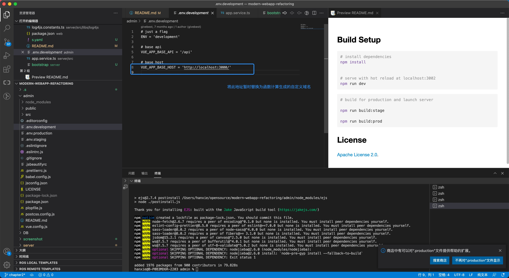

效果如下


基本能力是可以的，接下来测试上传部分
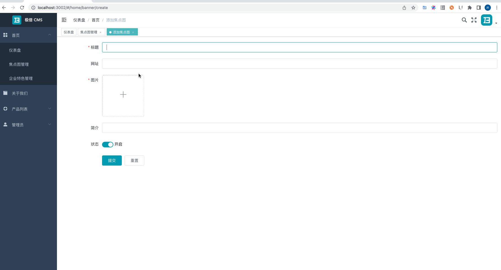

发现上传是可以，不过显示有问题。这里可以根据fc 提供的日志能力在线查询
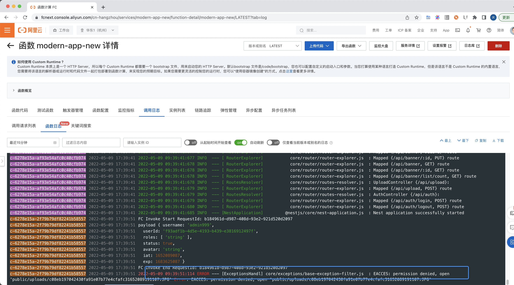 ，进一步排查问题，最终定位到是文件路径的问题，
修复的代码已经放到仓库，大家可以自行查看。
最终效果如下：
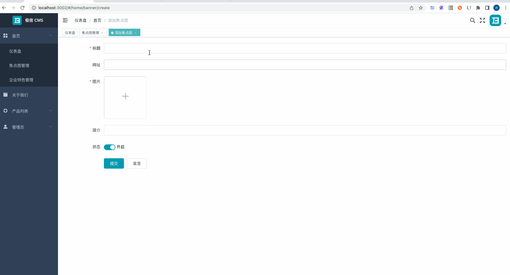

#### 部署方案
像这种纯静态的站点内容部署其实相对容易，我们只要打包成静态资源，丢到oss存储上即可，Serverless Devs 还提供了一些额外的服务，会自动帮你生成一个可访问域名。避免OSS自身的访问下载限制。当然纯静态的独立域是无法访问部署到fc 的api服务的，会有跨域问题，所以需要引入类似nginx的代理服务器设置，这里我们准备选择阿里云apigateway 来做这件事，关于apigateway放到下一步去看，此时先搞定admin的静态部署。接下来开始操作
##### 1. 构建admin静态资源
根据需要修改 vue.config.js（比如构建路径相对化），之后执行 ***npm run build:prod***

##### 2.配置s.yaml文件(截取service部分)
```yaml
www: # 静态资源
  component: oss
  props:
    region: ${vars.region}
    bucket: ${vars.oss.bucketName} # OSS bucket 自动生成
    subDir: ${vars.oss.bucketObject}
    acl: public-read # 读写权限
    codeUri: ./admin/dist # 指定本地要上传目录文件地址
    website: # OSS 静态网站配置
      index: index.html # 默认首页
      error: 404.html # 默认 404 页
      subDirType: redirect # 子目录首页 404 规则
    customDomains: # OSS 绑定域名
      - domainName: auto
        protocol: HTTP
```

##### 3.部署静态资源
执行 ***s www deploy***

最终自定义域名要先解析到cdn，再回源给 oss，这个时间可能会有几分钟延迟,不过最终确定结果是没问题的
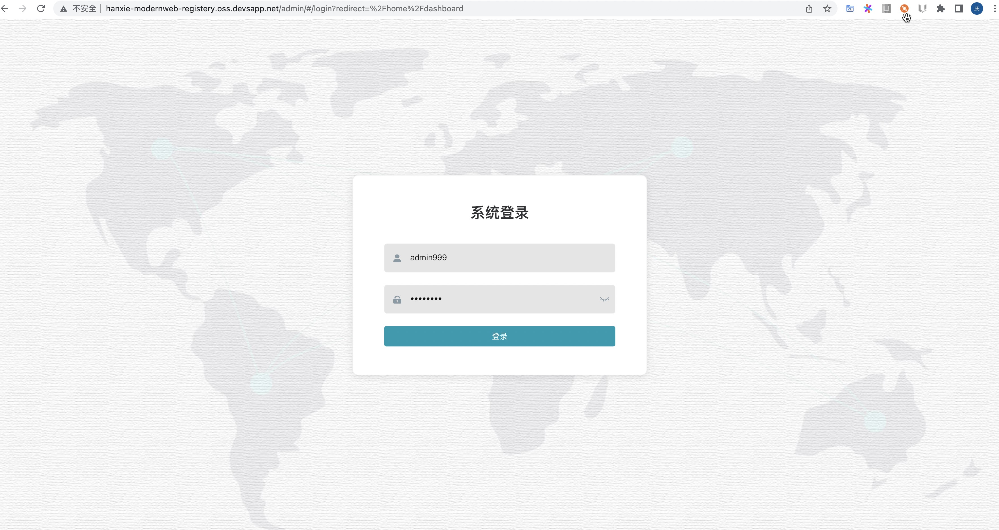

### 网关设置
接下来需要设置网关将后台服务和管理页面进行合并，从网关的设置上目前需要三个两个路由规则
+ 1.转发根目录到静态资源  /*
+ 2.转发api路径到动态函数服务 /prod-api/*
+ 3.上传文件需要的路径  /uploads/*

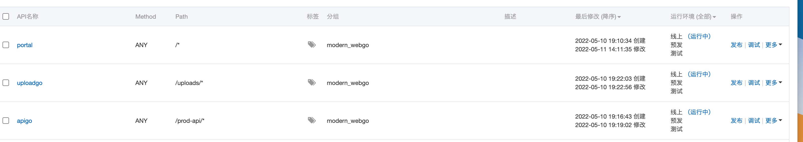
值得注意的是api网关的后端服务部分不管是oss还是动态的函数都要选择 Http(s)服务，单纯做转发。
oss是因为使用的共享实例，不支持直接由网关转发给oss，这块如果采用了专享实例还是建议直接使用oss
,函数计算没有被选择是因为网关转发到函数计算的Http触发器的时候会携带额外的请求头，导致业务的jwt验证失效，因此这两个全部都以转发web服务的方式进行。当一切就绪之后，再对网关做域名绑定，比如这里
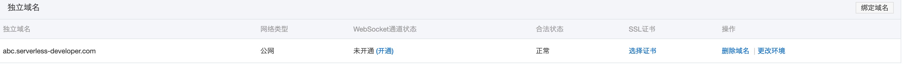
用abc.serverless-developer.com进行了绑定，输入域名之后我们访问即可看到效果。

