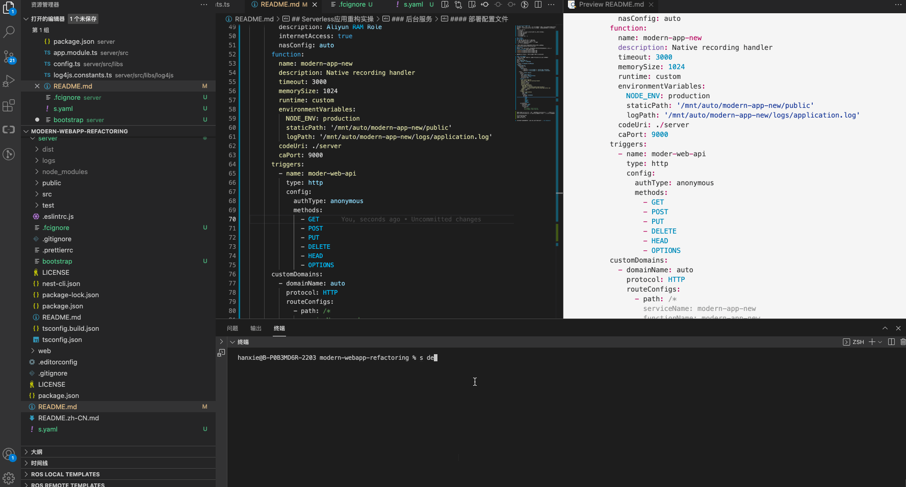

## Serverless应用重构实操
接下来我们正式开始改造，有一些准备工作需要做一下。开通阿里云的相关产品，申请自定义域名，下载开发者工具Serverless Devs，相关需要开通的产品列表如下(注：以下产品开通均不收费)
+ 阿里云函数计算
+ 阿里云OSS
+ 阿里云RDS for mysql serverless版 （也可以用已有的）
+ 阿里云Api Gateway
+ 阿里云DNS 服务
+ 阿里云NAS服务
+ 阿里云ARMS （选开）
### 预览地址
#### portal 页
http://hanxie-modernweb-registery.oss.devsapp.net/
#### 管理员页
http://hanxie-modernweb-registery.oss.devsapp.net/admin/
### 后台API服务
#### 测试项目
我们先测试一下后台部分,按照如下步骤
- 安装好本地数据库，并进行数据初始化
- 进入server 目录安装好依赖，执行启动指令
- 打开浏览器访问端口查看

测试效果如下，接口访问没有问题，数据库内容也查询的到

#### 代码改造
代码改造部分主要涉及日志和静态资源的路径，这个地方的处理我们通常使用
***process.env*** 的方式灵活替换。
[日志配置]

[文件上传]

[静态资源访问]

[数据库配置]

生产数据库部分请自行配置，保持跟计算服务网络畅通即可
改造完需要执行 ***npm run build*** 生成新的生产包
#### 配置文件
为了做多工程的统一管理，我们需要在根目录下创建s.yaml,内容如下
```javascript
edition: 1.0.0
name: modern-app-new
access: hanxie   # 秘钥别名
vars:
  region: cn-hangzhou #部署region
services:
  modern-app-new:
    component: fc
      actions:
        post-deploy:
          - component: fc nas upload -r ./server/logs /mnt/auto/
          - component: fc nas upload -r ./server/public /mnt/auto/
    props:
      region: ${vars.region}
      service:
        name: modern-app-new
        description: Aliyun RAM Role
        internetAccess: true
        nasConfig: auto
      function:
        name: modern-app-new
        description: Native recording handler
        timeout: 3000
        memorySize: 1024
        runtime: custom
        environmentVariables:
          NODE_ENV: production
          dbHost: ''
          dbPort: ''
          dbPassword: ''
          dbUserName: ''
          staticPath: '/mnt/auto/modern-app-new/public'
          logPath: '/mnt/auto/modern-app-new/logs/application.log'
        codeUri: ./server
        caPort: 3000
      triggers:
        - name: moder-web-api
          type: http
          config:
            authType: anonymous
            methods:
              - GET
              - POST
              - PUT
              - DELETE
              - HEAD
              - OPTIONS
      customDomains:
        - domainName: auto
          protocol: HTTP
          routeConfigs:
            - path: /*
              serviceName: modern-app-new
              functionName: modern-app-new

```
需要注意的是actions部分第一次执行的时候会创建nas目录，建议执行完毕后注释掉
之后在server根目录下创建一个 boostrap 的文件，用来做执行启动脚本，内容如下
```
#!/usr/bin/env bash
export PORT=3000
node dist/main.js
```
#### 部署
接下来的事情就变得比较简单了 该s.yaml同级目录下执行 ***s deploy***

#### 查看
最直接的是访问一下返回的自定义域名
比如 http://modern-app-new.modern-app-new.xxxxx.cn-hangzhou.fc.devsapp.net，你可以得到一个"Hello World" 
的返回，以为生产环境是不提供swagger访问页面，我们可以通过构造curl请求来查看时候接口api 也可以返回

```
curl -X 'GET' \
  'http://modern-app-new.modern-app-new.xxxxx.cn-hangzhou.fc.devsapp.net/api/banner?page=1&limit=10' \
  -H 'accept: */*'
```

测试效果如下

说明暂时成功，关于文件上传写入的部分现在还没法测试，等搞完管理后台可以再看看

### 后台管理员页面
#### 云上云下调试
先在本地测试一下线上接口服务，替换掉相应的服务配置


效果如下


基本能力是可以的，接下来测试上传部分


发现上传是可以，不过显示有问题。这里可以根据fc 提供的日志能力在线查询
 ，进一步排查问题，最终定位到是文件路径的问题，
修复的代码已经放到仓库，大家可以自行查看。
最终效果如下：


#### 部署方案
像这种纯静态的站点内容部署其实相对容易，我们只要打包成静态资源，丢到oss存储上即可，Serverless Devs 还提供了一些额外的服务，会自动帮你生成一个可访问域名。避免OSS自身的访问下载限制。当然纯静态的独立域是无法访问部署到fc 的api服务的，会有跨域问题，所以需要引入类似nginx的代理服务器设置，这里我们准备选择阿里云apigateway 来做这件事，关于apigateway放到下一步去看，此时先搞定admin的静态部署。接下来开始操作
##### 1. 构建admin静态资源
根据需要修改 vue.config.js（比如构建路径相对化），之后执行 ***npm run build:prod***

##### 2.配置s.yaml文件(截取service部分)
```yaml
www: # 静态资源
  component: oss
  props:
    region: ${vars.region}
    bucket: ${vars.oss.bucketName} # OSS bucket 自动生成
    subDir: ${vars.oss.bucketObject}
    acl: public-read # 读写权限
    codeUri: ./admin/dist # 指定本地要上传目录文件地址
    website: # OSS 静态网站配置
      index: index.html # 默认首页
      error: 404.html # 默认 404 页
      subDirType: redirect # 子目录首页 404 规则
    customDomains: # OSS 绑定域名
      - domainName: auto
        protocol: HTTP
```

##### 3.部署静态资源
执行 ***s www deploy***

最终自定义域名要先解析到cdn，再回源给 oss，这个时间可能会有几分钟延迟,不过最终确定结果是没问题的


### 网关设置
接下来需要设置网关将后台服务和管理页面进行合并，从网关的设置上目前需要三个两个路由规则
+ 1.转发根目录到静态资源  /*
+ 2.转发api路径到动态函数服务 /prod-api/*
+ 3.上传文件需要的路径  /uploads/*


值得注意的是api网关的额后端服务部分不管是oss还是动态的函数都要选择 Http(s)服务，单纯做转发。
oss是因为使用的共享实例，不支持直接由网关转发给oss，这块如果采用了专享实例还是建议直接使用oss
,函数计算没有被选择是因为网关转发到函数计算的Http触发器的时候会携带额外的请求头，导致业务的jwt验证失效，因此这两个全部都以转发web服务的方式进行。当一切就绪之后，再对网关做域名绑定，比如这里

用
abc.serverless-developer.com进行了绑定，输入域名之后我们访问即可看到效果。

